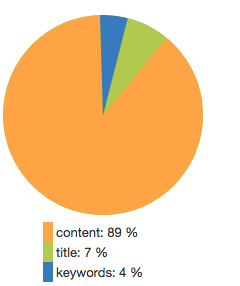

PHP Solr Explain
================

Apache Solr retrieves an detailed explain output how the score of a result is calculated. This explain result
is good for people who know how solr works, but it is also hard to understand.

php-solr-explain is a library that parses this explain output and calculates the impact of each field. Finally this information can be used, e.g.
to display a pie chart that shows the integrator which field had an impact on that match:

Thx
---

* Thx to Michael Klapper <michael.klapper@aoemedia.de> for helping on the initial version
* Solr.pl, Marek Rogoziński, Rafał Kuć

.. |buildStatusIcon| image:: https://travis-ci.org/TYPO3-solr/php-solr-explain.png?branch=master
   :alt: Build Status
   :target: https://travis-ci.org/TYPO3-solr/php-solr-explain
